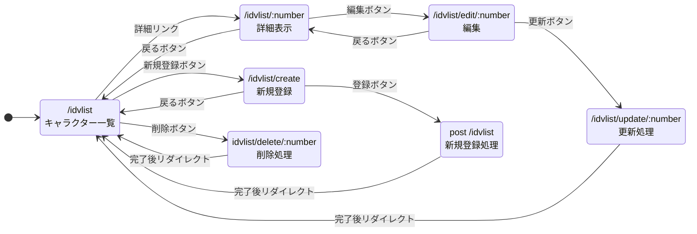
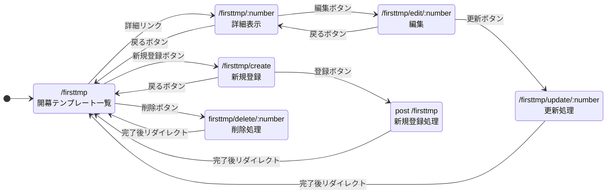
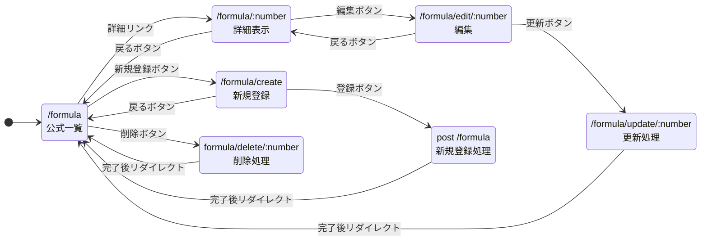

# システム仕様書

本ドキュメントは、キャラクター管理、開幕テンプレート管理、公式管理の3つの機能に関する仕様（データ構造、画面遷移、機能詳細）をまとめたものである．本仕様書は12/5の時点で制作したものであるため，いくつかの点でで変更を行う可能性がある．

## 1. キャラクター管理機能 (IdvList)

### 1-1. データ構造

| 論理名 | 物理名 | 型 | 説明 |
| :--- | :--- | :--- | :--- |
| ID | `id` | Integer | キャラクターID (主キー) |
| 名前 | `name` | String | キャラクター名 |
| 説明 | `description` | Text | キャラクターの詳細説明 |
| 画像 | `image` | String | 画像ファイルパスまたはURL |
| 作成日 | `created_at` | DateTime | 登録日時 |
| 更新日 | `updated_at` | DateTime | 最終更新日時 |

### 1-2. ページ遷移図

### 1-3. HTTPメソッドと機能詳細

| 機能・画面 | メソッド | リソース名 | 遷移元・操作 | 機能詳細・処理内容 | 処理後の表示 |
| :--- | :--- | :--- | :--- | :--- | :--- |
| **一覧表示** | GET | `/idvlist` | メニュー等のリンク | 登録済みのキャラクター一覧を表示する．各行に詳細・削除リンクを配置． | - |
| **詳細表示** | GET | `/idvlist/:number` | 一覧の「詳細」リンク | 指定IDのキャラクター詳細情報を表示する． | - |
| **新規登録画面** | GET | `/idvlist/create` | 一覧の「新規登録」ボタン | 新規登録用の入力フォームを表示する． | - |
| **新規登録処理** | POST | `/idvlist` | 登録画面の「登録」ボタン | フォームの入力値をDBに保存する． | 一覧画面へ遷移 |
| **編集画面** | GET | `/idvlist/edit/:number` | 詳細画面の「編集」ボタン | 既存データをフォームに入力済みで表示する． | - |
| **更新処理** | POST | `/idvlist/update/:number` | 編集画面の「更新」ボタン | フォームの内容でDBを更新する． | 一覧画面へ遷移 |
| **削除処理** | POST | `/idvlist/delete/:number` | 一覧画面の「削除」ボタン | 指定IDのデータを削除する． | 一覧画面へ遷移 |

---

## 2. 開幕テンプレート管理機能 (FirstTmp)

### 2-1. データ構造

| 論理名 | 物理名 | 型 | 説明 |
| :--- | :--- | :--- | :--- |
| ID | `id` | Integer | テンプレートID (主キー) |
| タイトル | `title` | String | テンプレートの見出し |
| 内容 | `content` | Text | テンプレートの本文 |
| 作成日 | `created_at` | DateTime | 登録日時 |
| 更新日 | `updated_at` | DateTime | 最終更新日時 |

### 2-2. ページ遷移図

### 2-3. HTTPメソッドと機能詳細

| 機能・画面 | メソッド | リソース名 | 遷移元・操作 | 機能詳細・処理内容 | 処理後の表示 |
| :--- | :--- | :--- | :--- | :--- | :--- |
| **一覧表示** | GET | `/firsttmp` | メニュー等のリンク | テンプレート一覧を表示する． | - |
| **詳細表示** | GET | `/firsttmp/:number` | 一覧の「詳細」リンク | 指定IDのテンプレート詳細を表示する． | - |
| **新規登録画面** | GET | `/firsttmp/create` | 一覧の「新規登録」ボタン | 新規登録フォームを表示する． | - |
| **新規登録処理** | POST | `/firsttmp` | 登録画面の「登録」ボタン | 入力データをDBに保存する． | 一覧画面へ遷移 |
| **編集画面** | GET | `/firsttmp/edit/:number` | 詳細画面の「編集」ボタン | 編集フォームを表示する． | - |
| **更新処理** | POST | `/firsttmp/update/:number` | 編集画面の「更新」ボタン | DBのデータを更新する． | 一覧画面へ遷移 |
| **削除処理** | POST | `/firsttmp/delete/:number` | 一覧画面の「削除」ボタン | 指定IDのデータを削除する． | 一覧画面へ遷移 |

---

## 3. 公式管理機能 (Formula)

### 3-1. データ構造

| 論理名 | 物理名 | 型 | 説明 |
| :--- | :--- | :--- | :--- |
| ID | `id` | Integer | 公式ID (主キー) |
| 公式名 | `name` | String | 計算式の名称 |
| 式・内容 | `expression` | Text | 計算式または定義内容 |
| 備考 | `note` | Text | 補足説明 |
| 作成日 | `created_at` | DateTime | 登録日時 |
| 更新日 | `updated_at` | DateTime | 最終更新日時 |

### 3-2. ページ遷移図

### 3-3. HTTPメソッドと機能詳細

| 機能・画面 | メソッド | リソース名 | 遷移元・操作 | 機能詳細・処理内容 | 処理後の表示 |
| :--- | :--- | :--- | :--- | :--- | :--- |
| **一覧表示** | GET | `/formula` | メニュー等のリンク | 公式データ一覧を表示する． | - |
| **詳細表示** | GET | `/formula/:number` | 一覧の「詳細」リンク | 指定IDの公式詳細を表示する． | - |
| **新規登録画面** | GET | `/formula/create` | 一覧の「新規登録」ボタン | 新規登録フォームを表示する． | - |
| **新規登録処理** | POST | `/formula` | 登録画面の「登録」ボタン | 入力データをDBに保存する． | 一覧画面へ遷移 |
| **編集画面** | GET | `/formula/edit/:number` | 詳細画面の「編集」ボタン | 編集フォームを表示する． | - |
| **更新処理** | POST | `/formula/update/:number` | 編集画面の「更新」ボタン | DBのデータを更新する． | 一覧画面へ遷移 |
| **削除処理** | POST | `/formula/delete/:number` | 一覧画面の「削除」ボタン | 指定IDのデータを削除する． | 一覧画面へ遷移 |